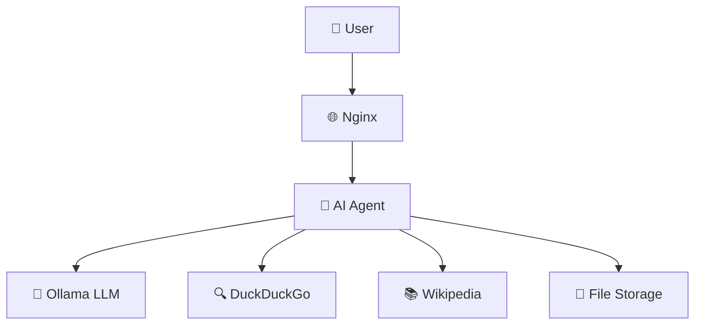

# 🤖 AI Research Agent

<div align="center">


</div>

```
    🔍 Research Agent
   ┌─────────────────┐
   │  🧠 AI Brain    │ ──► 🌐 Web Search
   │  📚 Knowledge   │ ──► 📖 Wikipedia  
   │  💾 Memory      │ ──► 💾 File Save
   └─────────────────┘
```

## 📋 Description

An intelligent research agent that uses **Ollama** as a local language model, **LangChain** as framework, and multiple tools to perform comprehensive and structured research.

### ✨ Features

- 🤖 **Local AI**: Uses Ollama for local processing without sending data externally
- 🔍 **Web Search**: DuckDuckGo integration for real-time searches
- 📚 **Wikipedia**: Direct access to the world's largest encyclopedia
- 💾 **Persistence**: Automatically saves research results
- 🐳 **Docker**: Complete deployment with Docker Compose
- 🌐 **Nginx**: Web server for HTTP access

## 🚀 Quick Installation

### Prerequisites

- 🐳 Docker & Docker Compose
- 🐍 Python 3.13+ (for local development)

### 🐳 With Docker (Recommended)

```bash
# 1. Clone the repository
git clone <your-repository>
cd ai-agent

# 2. Configure environment variables
cp .env.example .env
# Edit .env with your API keys (optional for Ollama)

# 3. Start all services
docker-compose up -d

# 4. Download model in Ollama (first time)
docker exec -it ollama ollama pull granite4:350m
```

### 🐍 Local Installation

```bash
# 1. Create virtual environment
python -m venv venv
source venv/bin/activate  # Linux/Mac
# venv\Scripts\activate   # Windows

# 2. Install dependencies
pip install -r requirements.txt

# 3. Configure environment variables
cp .env.example .env

# 4. Run
python main.py
```

## 🎯 Usage

### With Docker

Once services are up, the agent will be available at:
- **Application**: `http://localhost:80` (via Nginx)
- **Ollama API**: `http://localhost:11434`

### Usage Example

```python
# The agent will respond in structured format:
{
    "topic": "How to make pancakes",
    "summary": "Pancakes are...",
    "sources": ["https://example.com", "Wikipedia"],
    "tools_used": ["web_search", "wikipedia_search"]
}
```

## 🛠️ Available Tools

| Tool | Description | Usage |
|------|-------------|-------|
| 🔍 **Web Search** | DuckDuckGo search | Updated information |
| 📚 **Wikipedia** | Encyclopedia queries | Verified knowledge |
| 💾 **File Save** | Automatic saving | Result persistence |

## 🏗️ Architecture



## 📁 Project Structure

```
ai-agent/
├── 🐳 compose.yml          # Docker Compose
├── 🐳 Dockerfile           # App image
├── 🌐 nginx.conf           # Nginx configuration
├── 🤖 main.py              # Main application
├── 🛠️ tools.py             # Agent tools
├── 📋 requirements.txt     # Python dependencies
├── 🔒 .env.example         # Environment variables
├── 🚫 .gitignore          # Ignored files
└── 📖 README.md           # This file
```

## ⚙️ Configuration

### Environment Variables

```bash
# .env
ANTHROPIC_API_KEY="your-api-key-here"  # Optional
OPENAI_API_KEY="your-api-key-here"     # Optional
```

### Available Ollama Models

```bash
# Recommended models
ollama pull granite4:350m    # Fast and efficient
ollama pull llama2          # General model
ollama pull codellama       # Code specialized
```

## 🔧 Development

### Adding New Tools

```python
# tools.py
@tool
def new_tool(parameter):
    """Tool description"""
    # Your logic here
    return result
```

### Customize the Agent

```python
# main.py
agent = create_agent(
    model=llm,
    tools=[new_tool],  # Add here
    system_prompt="Your custom prompt"
)
```

## 🐛 Troubleshooting

### Common Issues

| Problem | Solution |
|---------|----------|
| 🚫 Ollama not responding | `docker-compose restart ollama` |
| 📦 Model not found | `docker exec -it ollama ollama pull <model>` |
| 🌐 Connection error | Check that all services are running |

### Logs

```bash
# View logs from all services
docker-compose logs -f

# View specific logs
docker-compose logs -f ai-agent
docker-compose logs -f ollama
docker-compose logs -f nginx
```

## 🤝 Contributing

1. 🍴 Fork the project
2. 🌿 Create a branch (`git checkout -b feature/new-feature`)
3. 💾 Commit your changes (`git commit -m 'Add new feature'`)
4. 📤 Push to the branch (`git push origin feature/new-feature`)
5. 🔄 Open a Pull Request

## 📄 License

This project is under the MIT License - see the [LICENSE](LICENSE) file for details.

## 🙏 Acknowledgments

- 🦙 [Ollama](https://ollama.ai/) - Local LLM
- 🔗 [LangChain](https://langchain.com/) - AI Framework
- 🐳 [Docker](https://docker.com/) - Containerization
- 🌐 [Nginx](https://nginx.org/) - Web Server

---

<div align="center">

**Made with ❤️ and lots of ☕!**


</div>